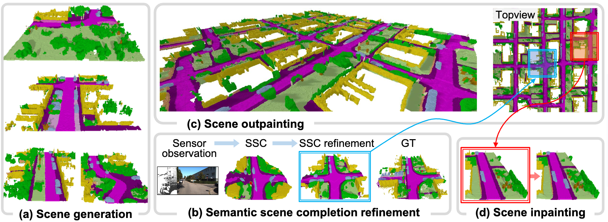

<h1 align=center>
SemCity: Semantic Scene Generation 

with Triplane Diffusion
</h1>

> SemCity : Semantic Scene Generation with Triplane Diffusion
> 
> Jumin Lee*, Sebin Lee*, Changho Jo, Woobin Im, Juhyeong Seon and Sung-Eui Yoon* 

[Paper](https://arxiv.org/abs/2403.07773) | [Project Page](https://sgvr.kaist.ac.kr/SemCity)

## 📌 Setup
We test our code on Ubuntu 20.04 with a single RTX 3090 or 4090 GPU.

### Environment 

    git clone https://github.com/zoomin-lee/SemCity.git
    conda create -n semcity 
    conda activate semcity
    conda install pytorch==2.1.0 torchvision==0.16.0 torchaudio==2.1.0 pytorch-cuda=11.8 -c pytorch -c nvidia
    pip install blobfile matplotlib prettytable tensorboard tensorboardX scikit-learn tqdm
    pip install --user -e .

### Datasets
We use the SemanticKITTI and CarlaSC datasets. See [dataset.md](./dataset/dataset.md) for detailed data structure.

Please adjust the `sequences` folder path in `dataset/path_manager.py`.

## 📌 Training
Train the Triplane Autoencoder and then the Triplane Diffusion.
You can set dataset using `--dataset kitti` or `--dataset carla`.
In/outpainting and semantic scene completion refinement are only possible with SemanticKITTI datasets.

### Triplane Autoencoder

    python scripts/train_ae_main.py --triplane True --save_path exp/ae

When you are finished training the triplane autoencoder, save the triplane. 
The triplane is a proxy representation of the scene for triplane diffusion training.

    python scripts/save_triplane.py --data_name voxels --save_tail .npy --resume {ae.pt path}

If you want to train semantic scene completion refinement, also save the triplane of the result of the ssc method (e.g. monoscene).

    python scripts/save_triplane.py --data_name monoscene --save_tail _monoscene.npy --resume {ae.pt path}

### Triplane Diffusion

For training for semantic scene generation or in/outpainting,

    python scripts/train_diffusion_main.py --ssc_refine False --triplane_loss_type l2 --save_path exp/diff

For training semantic scene completion refinement,

    python scripts/train_diffusion_main.py --ssc_refine True --refine_dataset monoscene --triplane_loss_type l1 --save_path exp/diff

## 📌 Sampling
In `dataset/path_manager.py`, adjust the triplane autoencoder and triplane diffusion `.pt` paths to `AE_PATH` and `DIFF_PATH`.

To generate 3D semantic scene like `fig(a)`,

    python sampling/generation.py --num_samples 10 --save_path exp/gen

For semantic scene completion refinement like `fig(b)`,

    python sampling/ssc_refine.py --refine_dataset monoscene --save_path exp/ssc_refine

Currently, we're only releasing the code to outpaint twice the original scene.

    python sampling/outpainting.py --load_path figs/000840.label --save_path exp/out

For inpainting, as in `fig(d)`, you can define the region (top right, top left, bottom right, bottom left) where you want to regenerate.

    python sampling/inpainting.py --load_path figs/000840.label --save_path exp/in

## 📌 Evaluation

We render our scene with [pyrender](https://pyrender.readthedocs.io/en/latest/index.html) and then evaluate it using [torch-fidelity](https://github.com/toshas/torch-fidelity). 

## Acknowledgement
The code is partly based on [guided-diffusion](https://github.com/openai/guided-diffusion), [Sin3DM](https://github.com/Sin3DM/Sin3DM) and [scene-scale-diffusion](https://github.com/zoomin-lee/scene-scale-diffusion). 

## Bibtex
If you find this code useful for your research, please consider citing our paper:

    @inproceeding{SemCity,
        title = {SemCity: Semantic Scene Generation with Triplane Diffusion},
        author = {Jumin Lee, Sebin Lee, Changho Jo, Woobin Im, Juhyeong Seon and Sung-Eui Yoon},
        booktitle = {CVPR},
        year={2024}
    }

